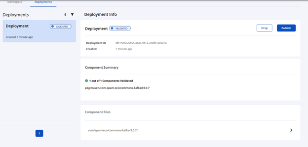
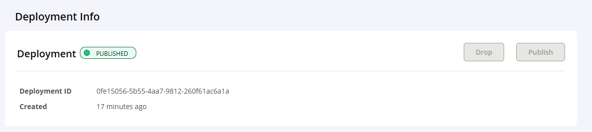

[Official guide from Central Maven](https://central.sonatype.org/publish/publish-portal-maven/)

### How to upload artifact to Central Sonatype repository for Maven Central promoting

1. [Configure PGP](https://central.sonatype.org/pages/working-with-pgp-signatures.html)
2. Save the generated credentials for use in your publishing setup. See how to
   [generate-portal-token](https://central.sonatype.org/publish/generate-portal-token/).
3. `mvn release:clean release:prepare`.
4. After successful run you will be able to find tag in the vcs for new version of your artifact.
4. `mvn release:perform`.
5. After successful run you will be able to find your artifact in the [Central Sonatype repository](https://central.sonatype.com/publishing/deployments).
6. Because of default`<autoPublish>false</autoPublish>` for `central-publishing-maven-plugin`
   you will see 2 buttons `Drop` and `Publish`, pay attention that Maven Central Release can't be
   undone.
   and only then press the `Publish`.
   `Drop` button simply delete your artifact from
   [Central Sonatype repository](https://central.sonatype.com/publishing/deployments). If you feel confidence you can just set
   `<autoPublish>true</autoPublish>` for `central-publishing-maven-plugin`, in this situation
   release to the Maven Central will be performed automatically without extra steps with buttons (`Publish`, `Drop`).
   
7. The published versions will be available at [versions](https://central.sonatype.com/namespace/com.epam.eco.schemacatalog).
### Notes

[SNAPSHOT deployments repository](https://central.sonatype.org/publish/publish-portal-snapshots/)
